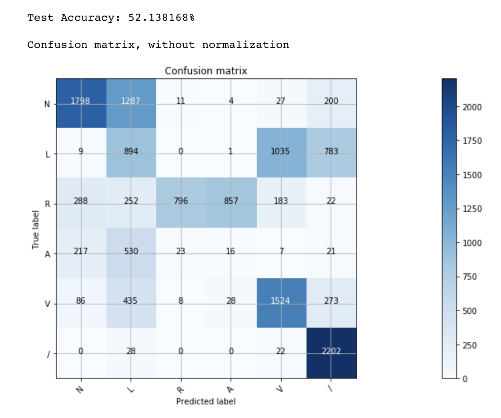

# ECG Classification

This project is machine learning algorithm to classify/detect arrhythmia.

I use DNNClassifier in tensorflow.

### Requirements

---

1. python 3.5.2
2. tensorflow-gpu 1.10.0

### Usage

---

1. Run ***create_dataset.ipynb***
2. Run ***classfication.ipynb***
3. That's all

### Result

---

- Accuracy :  About 75%

